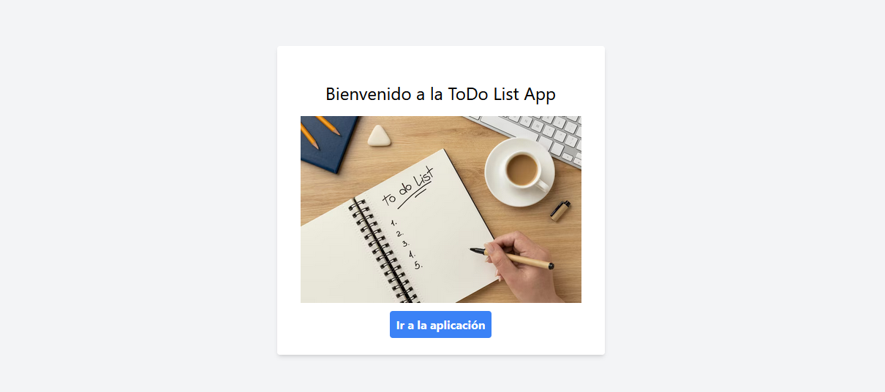
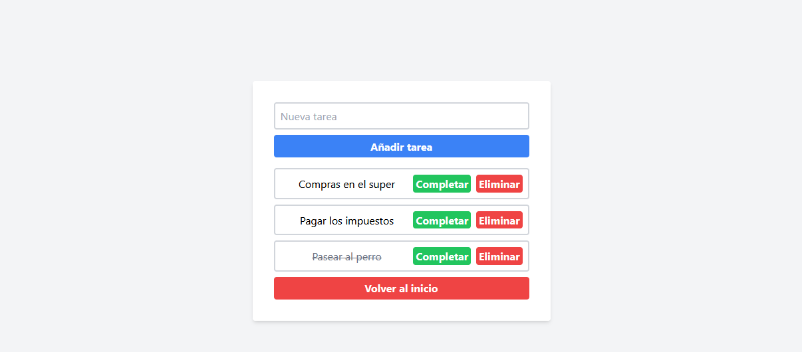

# Trabajo Práctico Integrador - Comisión 112 UTN Argentina Programa 4.0
# To-Do List App

Una sencilla aplicación web de lista de tareas desarrollada en React con Vite, diseñada para gestionar y organizar tus tareas diarias. La aplicación utiliza componentes funcionales, el hook `useState` para el manejo del estado, el hook `useEffect` para realizar efectos secundarios, y eventos para interactuar con el usuario.

## Características

- **Componentes Funcionales:**
  - `TaskList`: Componente que muestra la lista de tareas.
  - `TaskItem`: Componente que representa un elemento individual en la lista de tareas.
  - `TaskForm`: Componente que permite al usuario agregar nuevas tareas.

- **Hooks Utilizados:**
  - `useState`: Utilizado para gestionar el estado de la lista de tareas.
  - `useEffect`: Implementado para realizar efectos secundarios, como cargar datos iniciales.

- **Interacción con el Usuario:**
  - **Componente de Lista (`TaskList`):**
    - Marcar tareas como completadas.
    - Eliminar tareas de la lista.

  - **Componente de Formulario (`TaskForm`):**
    - Agregar nuevas tareas a la lista.

## Capturas de Pantalla

*Descripción opcional de la captura de pantalla.*

*Descripción opcional de la captura de pantalla.*

## Instalación

1. Clona este repositorio: `git clone https://github.com/tuusuario/tu-proyecto.git`
2. Navega al directorio del proyecto: `cd tu-proyecto`
3. Instala las dependencias: `npm install`
4. Inicia la aplicación: `npm start`

## Contribuir

¡Siéntete libre de contribuir! Abre un problema o envía un pull request para sugerencias, correcciones de errores o nuevas características.

## Licencia

Este proyecto está bajo la licencia [MIT](LICENSE).

---
**Nota:** Este proyecto es parte de un ejercicio práctico y puede no estar destinado a su uso en entornos de producción.

